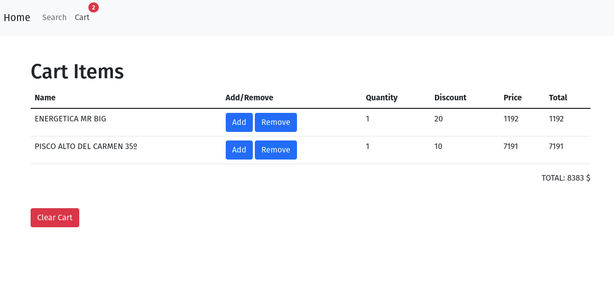
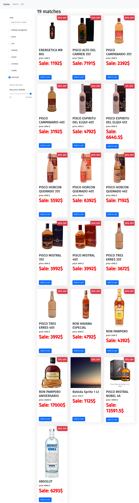

# Online Store - bsale

This is the front-end project for the Ruby on Rails back-end. Here the API is rendered. The items are rendered from the requests done to the back-end. It is possible to search by categories, price, and name. Additionally, you can add items to the cart, erase them one by one, or the whole cart.

The link for the
[Netlify-Deployment](https://61b6c8a4e5d4a6d1def961bb--competent-mcnulty-9b9b65.netlify.app/)

## WebSite Sections

- Homepage, all items are render from the api.
  
- Cart, Add or Remove items from the Cart List.
  
- Search in the database by name, price, category or/and discount.
  

## Built With

- JavaScript
- HTML
- CSS
- React
- Redux
- Bootstrap
- Package.json

## How to start the project from your Local environment

- Open your terminal and cd where you want to store the project
- Run the following command - `git clone https://github.com/Wusinho/tienda-licor-front-end`
- Cd into the created directory
- Run `npm install` to install all dependencies
- To run the pogram type `npm start` on your terminal.

## Author

👤 **Heber Lazo**

- Github: [@Wusinho](https://github.com/Wusinho)
- LinkedIn: [Heber Lazo](https://www.linkedin.com/in/heber-lazo-benza-523266133/)

## 🤝 Contributing

Contributions, issues, and feature requests are welcome!

## Show your support

Give a star if you :star: like this project!

## 📝 License

This project is [MIT](LICENSE) licensed.
