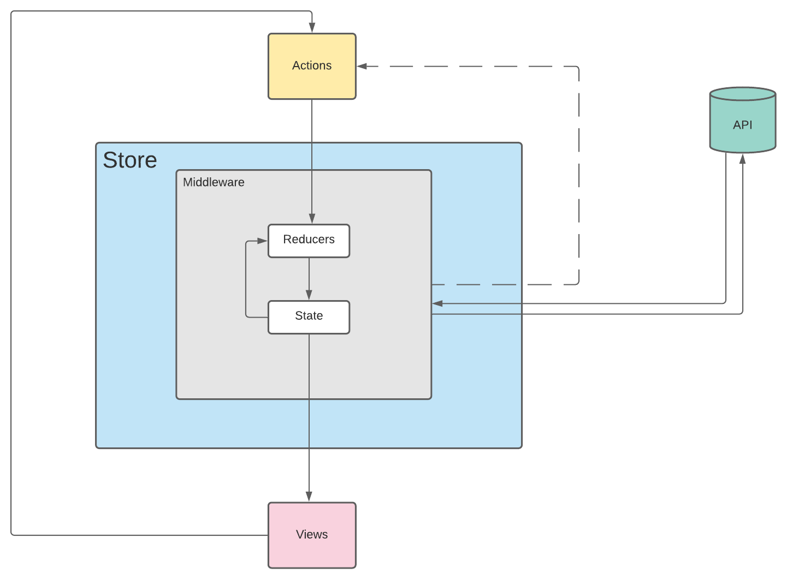
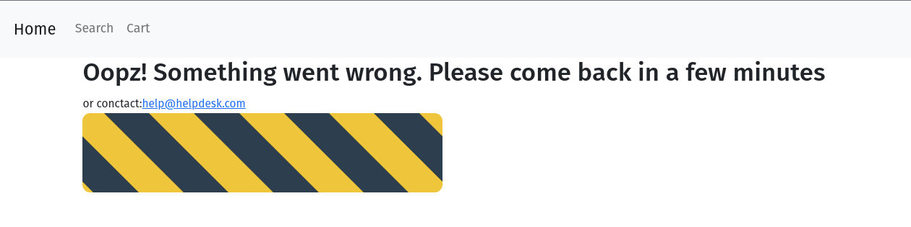

# Online Store - bsale

# Objectives

Build an online store that displays products grouped by category, generating separately backend (REST API) and frontend and using the database that is available to its development.

In addition, you have to add a search engine, which has to be implemented at the server, through an API Rest whose language and framework can be free choice.

The front-end must be developed with vanilla javascript without any framework, the use of libraries, components
specific, such as; bootstrap, material, Jquery, among others are allowed.

Finally, make the application and the repository available with the code and the hosting.

# Description of the Project

For the development of the project, the following tools were used:

- JavaScript
- HTML
- CSS
- React
- Redux
- Bootstrap
- Package.json

The front-end was built using react and redux library.
On the homepage, there are two request actions to the REST-API using redux middleware.

- The first request is to the end-point '/products' to get all the products in the database.
- The second request is to '/categories' to get all the product ids and categories.

  - Redux data flow.

  

  The middleware is in charge of the process that handles the request and response. Once there is a 200 response, the data from the API is stored in Redux-store and through the react component HOME, the information is displayed.

  - The homepage displays all the products from the API.

  

If there's an error of somekind a message will appear.

The homepage displays all products with the following details: name, price, discount, and the sale price.

The customer can browse through all the products that might be of interest, then add them to the cart. A small counter will keep track every time a new item is selected. Once the customer has finished, it is possible to check all the items that were selected, if needed it is possible to add more items, remove them or delete the whole shopping cart.

- Add or Remove items from the Cart List.

  

If the customer needs a more in-depth search, there is a search tab at the top of the navbar. From this part of the webpage is possible to add items to shopping cart.

Every time there's a new search a request is sent to the '/search' endpoint through redux middleware to the API. If there's a 200 response, the data will be stored in redux and then displayed.

- Search in the database by name, price, category and/or discount.

  

[Netlify-Deployment](https://61b6c8a4e5d4a6d1def961bb--competent-mcnulty-9b9b65.netlify.app/)
It may take some time for the page to load since Heroku also needs time to load the back-end.

## WebSite Sections

- The database structure, there are two tables. There's one assosiation Product belongs_to Category

  

  ### **Endpoints of API**

  | Method | Endpoint   |      Functionality |
  | ------ | ---------- | -----------------: |
  | GET    | products   |   Get the products |
  | GET    | categories | Get the categories |
  | GET    | search     |     Get the search |

These are the 3 endpoints needed to display all the information in the webpage.

For example in the local environment the BASEURL will be : http://localhost:3000/

- Get BASE_URL+products, the request to this end point will give a response with all the products in the database
- Get BASE_URL+categories, the request to this end point will give a response with all the categories from the product in the database.
- Get BASE_URL+search, the request is a string with all the different search arguments you need ( name, price, discount or any category from the menu)

## How to start the project from your Local environment

- Open your terminal and cd where you want to store the project
- Run the following command - `git clone https://github.com/Wusinho/tienda-licor-front-end`
- Cd into the created directory
- Run `npm install` to install all dependencies
- To run the pogram type `npm start` on your terminal (by default http://localhost:3000, remember that the back-end should run at a different port).

## Author

👤 **Heber Lazo**

- Github: [@Wusinho](https://github.com/Wusinho)
- LinkedIn: [Heber Lazo](https://www.linkedin.com/in/heber-lazo-benza-523266133/)

## 🤝 Contributing

Contributions, issues, and feature requests are welcome!

## Show your support

Give a star if you :star: like this project!

## 📝 License

This project is [MIT](LICENSE) licensed.
