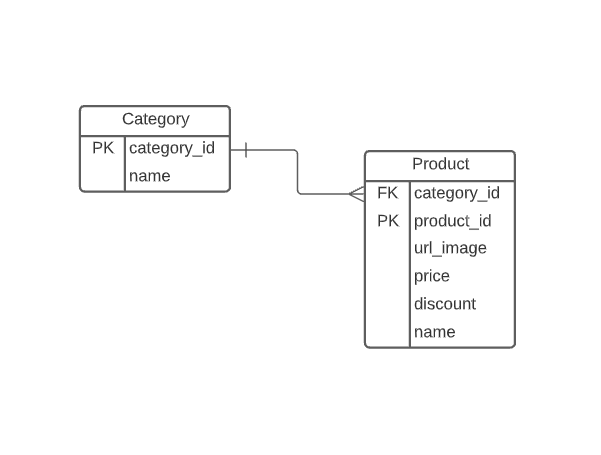

# Online Store - bsale

This is the front-end project for the Ruby on Rails back-end. Here the end points from the back-end are consumed and rendered. The items are rendered from the requests done to end points from the back-end.
The project consist on building a online store where products can be displayed by categories.
It is possible to search by categories, price, and/or name, all this has to be implemented in the back-end. Additionally, it is possible to add items to the cart, erase them one by one add more products, or erase the whole cart with a single click.

The link for the
[Netlify-Deployment](https://61b6c8a4e5d4a6d1def961bb--competent-mcnulty-9b9b65.netlify.app/)

## WebSite Sections

- Homepage, all items are render from the api.

  

- Cart, Add or Remove items from the Cart List.

  

- Search in the database by name, price, category or/and discount.

  

- The database structure, there are two tables. There's one assosiation Product belongs_to Category

  

  ### **Endpoints of API**

  | Method | Endpoint   |      Functionality |
  | ------ | ---------- | -----------------: |
  | GET    | products   |   Get the products |
  | GET    | categories | Get the categories |
  | GET    | search     |     Get the search |

  There are 3 current endpoints that are currently working.

  For example in the local environment the BASEURL will be : http://localhost:3000/

  - Get BASE_URL+products, the request to this end point will give a response with all the products in the database
  - Get BASE_URL+categories, the request to this end point will give a response with all the categories from the product in the database.
  - Get BASE_URL+search, the request is a string with all the different search arguments you need ( name, price, discount or any category from the menu)

## Built With

- JavaScript
- HTML
- CSS
- React
- Redux
- Bootstrap
- Package.json

## How to start the project from your Local environment

- Open your terminal and cd where you want to store the project
- Run the following command - `git clone https://github.com/Wusinho/tienda-licor-front-end`
- Cd into the created directory
- Run `npm install` to install all dependencies
- To run the pogram type `npm start` on your terminal (by default http://localhost:3000, remember that the back-end should run at a different port).

## Author

👤 **Heber Lazo**

- Github: [@Wusinho](https://github.com/Wusinho)
- LinkedIn: [Heber Lazo](https://www.linkedin.com/in/heber-lazo-benza-523266133/)

## 🤝 Contributing

Contributions, issues, and feature requests are welcome!

## Show your support

Give a star if you :star: like this project!

## 📝 License

This project is [MIT](LICENSE) licensed.
